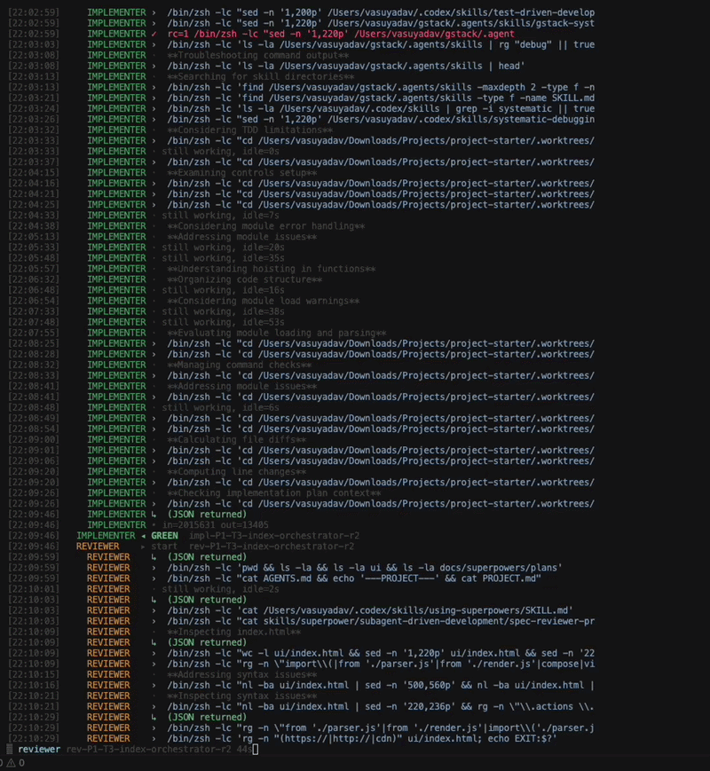

# 🎲 YOLO starter

<p align="center">
  
</p>

<p align="center">
  
  
  
  
  
  
</p>

<p align="center"><em>One prompt in. Phased, reviewed, audited PRs out.<br><code>--dangerously-bypass-approvals-and-sandbox</code> with adult supervision (mostly).</em></p>

> A single ~1000-line Python script that beats the `codex` CLI into a phased **CEO → CTO → Architect → (Implementer ↔ Reviewer) → Auditor** pipeline. Just a script you bend until it looks like your project.

<p align="center">
  
</p>

---

## Who this is for

You are this person:

- You main **`codex` (the CLI)**. Not Claude Code, not Cursor agent mode, not Gemini, not whatever raised a Series A on Tuesday.
- You're a **dev or solo builder** with a side project (or four) and a half-baked but real idea of what you want.
- You can write a spec in plain English without crying. You know what "auth", "rate limit", and "do not, under any circumstance, drop the prod DB" mean.
- You want to lean the fuck back, sip something, and watch your codex quota evaporate while a tiny org of agents ships a phase for you.
- You've configured a TOML file in your life and survived.

## Who this is NOT for

If you nod at any of these, this script will **make your life materially worse**:

- "I don't know what I'm building, the AI will figure it out." — Cool, it absolutely will figure out *something*. You will not like it. You will rage-tweet about it.
- "I want enterprise-grade orchestration with SOC2, SSO, and a man named Greg on the support line." — Wrong door, champ. Buy a platform.
- "I want a UI, dashboards, multi-provider routing, OAuth-connected agents, and a virtual office of fake employees." — Different tool category. See below.
- "I want guaranteed correct code." — Lol. Lmao, even. ROFL, if you're into vintage.

This is an **experimental, opinionated, single-script starter** for your next/existing **side project**. Use at your own risk. We do not take ownership of whatever the agents do to your repo. The only thing we guarantee is **the script runs** — given a real prompt, an authenticated `codex`, and a git repo that exists.

> *Don't hate the player. Hate the game.* (The game is the LLM.)

---

## What this is NOT (the "we're not competing, please don't fight us" section)

Several genuinely brilliant projects already exist for "orchestrate N coding agents across M providers with a kanban board and a vibe." If that's what you want, go use them — they're great and they have actual maintainers:

- [GSD / get-shit-done](https://github.com/gsd-build/get-shit-done) — spec-driven dev for Claude Code, sub-agent fan-out, very polished, ~60K stars and counting. Adults made this.
- [Claw Orchestrator](https://github.com/Enderfga/claw-orchestrator) — wraps Claude Code, Codex, Gemini, Cursor, OpenCode etc. as one unified runtime. Big API surface. Multi-provider as a feature, not an accident.
- [Composio Agent Orchestrator](https://github.com/ComposioHQ/agent-orchestrator) — parallel coding agents, autonomous CI fixes, merge conflict handling. Bless.
- [BMAD](https://github.com/bmad-code-org/BMAD-METHOD), [SpecKit](https://github.com/github/spec-kit), [Taskmaster](https://github.com/eyaltoledano/claude-task-master) — full spec/plan/execute frameworks with proper docs and a community.

**YOLO starter is not that.** It is:

- Single provider — **codex only**, on purpose, by design, end of discussion.
- Single script — one Python file, no daemon, no server, no dashboard, no telemetry, no analytics, no "Welcome to our discord."
- Single project — drop it in, configure it, ship a side project, never think about it again until it breaks.
- Not a platform. Not a runtime. Not a framework. It's a **starter**. The kind you eat before the actual meal.

You bend it. You rewrite the prompts. You swap models. You add skills if you want them. You delete what offends you. It's a chef's knife, a butcher's knife, a butter knife — depends what you sharpen it into. Sky's the limit and the failure mode is also you. Own it. Bring a band-aid.

### "Can I run this with Claude Code / Gemini / Cursor / [favorite agent]?"

Technically? Yeah, kind of. Practically? Don't.

The script shells out to `codex exec --json` everywhere — that's hardcoded because Codex's JSON event stream is what the parser eats. **Other CLIs (Claude Code, Gemini CLI, Cursor Agent, OpenCode, etc.) can absolutely orchestrate this script from the outside** — run `scripts/codex-org start "..."`, parse `events.jsonl`, react to events, whatever. You can wrap this thing in any meta-orchestrator you like; it doesn't care who's calling it.

What you **cannot** do (without surgery) is have Claude Code or Gemini fill one of the **roles** (CEO/CTO/Implementer/etc) inside the pipeline. The CEO is `codex exec`. The CTO is `codex exec`. The Implementer is `codex exec`. Six of them. All codex. If you want a Claude-flavored Implementer, fork the script, swap the role's binary, re-glue the JSON parser. It's a hundred lines of Python. You can do it. I just didn't, because **I built this for me, and I use codex**. Sue me. (Don't.)

**TL;DR:** any agent can drive this script from outside. No non-codex agent is wired in as a role inside this script. Different verbs, different problems.

---

## Creator's note (the part where I get unhinged)

I tried the orchestrators. I tried the platforms. I tried the dashboards with the cute little kanban columns. Same exact thing happened to me **every. single. time.**

1. Agent gets confused mid-phase.
2. Agent forgets the plan exists.
3. Agent hallucinates a function. Confidently. With docstrings.
4. Agent merges the hallucination into main.
5. I open the diff. I make a sound a human shouldn't make.
6. I rage-quit and rewrite it myself, badly, at 2am, fueled by spite and instant ramen.

So I wrote this. It's not pretty. It's not enterprise. It's a single Python script with phased gates that **forces** the agents to:

1. Write a spec (CEO talks to *you*, not a vibe board).
2. Write a plan (CTO).
3. Get the plan ripped apart by an Architect.
4. Run Implementer ↔ Reviewer pairs in **isolated git worktrees** so when one of them inevitably loses its mind, it only ruins its own worktree, not yours.
5. Run an Auditor across worktrees before anything touches `main` — and even then, only via a PR you have to merge yourself, you adult, you.

Yes, `codex` already has YOLO mode. Yes, it works fine on small scoped tasks. But it will happily run in a single directory, hit its turn limit, write half a feature, and then just… stop, like a Roomba in front of a dark hallway.

You can also run `codex` with skill frameworks like [**gstack**](https://github.com/garrytan/gstack) (Garry Tan's opinionated Claude-Code-and-also-Codex setup — CEO, Designer, Eng Manager, QA, etc. as skills) or [**superpowers**](https://github.com/obra/superpowers) (Obra's composable agentic-skills framework — brainstorming, worktrees, writing-plans, TDD, the whole shelf). The CEO/CTO archetypes here will behave roughly the same as theirs — those frameworks influenced this one and you can absolutely use them together. But you trade one set of problems for another:

- standalone codex still stops at one phase (turn limit, context exhaustion, sandbox boredom)
- with gstack or superpowers attached, codex starts spawning sub-agents per skill — fantastic until it overshoots scope, loops forever inside one skill, or stalls in a sub-call you can't see

This script's bet is different: pull only the **load-bearing behavior** from those skill frameworks (TDD discipline, completeness gates, systematic debugging, confidence calibration, anti-feature-creep, the actually-useful parts), **inline it directly into each role's prompt**, and **cap the agent fan-out** — per task: one Implementer, one Reviewer (paired), and one Auditor at the phase boundary. No mystery sub-agents. No context starvation. The agents actually finish what the CEO spec asks for. Call it [superpowers](https://github.com/obra/superpowers) on steroids with a leash, or [gstack](https://github.com/garrytan/gstack) without the kanban — whichever metaphor lands.

So: this script gives YOLO mode **structure** — a phase plan from your CEO conversation, a worktree per task, an implementer/reviewer pair per worktree, an auditor on the phase branch. If one agent shits the bed, the blast radius is one worktree. The other tasks keep going like nothing happened. You can restart the failed one with one command and zero feelings.

You can configure agent count, models, skills, and prompts however suits you. The script does not care.

Have I shipped real things with this? Yeah. The catch: **you have to be smart enough and elaborate enough to actually describe what you want**. If you give the CEO three sentences and a vibe, you get three sentences and a vibe back, in code form. Garbage in, garbage worktrees out. Cope.

> If you treat your codex quota like water in the Sahara (same energy here), configure cheaper models with lower reasoning in `workflow/org.defaults.json`. You'll lose some quality. You'll save your wallet. Trade-off. Knife. Your hand. Don't email me.

---

## The architecture, in one slightly hostile diagram

```
       you ─── prompt ──▶  CEO  ◀── chat ── you (answering the CEO's questions)
                            │                 (yes you still have to think)
                            ▼
                  docs/superpowers/specs/<slug>.md   (phased spec)
                            │
                            ▼
                          CTO  ◀── 5x ──▶  Architect      (plan ↔ review loop)
                            │                            (architect is the asshole, on purpose)
                            ▼
                  docs/superpowers/plans/<slug>.md   (per-phase plan + task graph)
                            │
              ┌─────────────┼─────────────┐
              ▼             ▼             ▼
        task1 worktree  task2 worktree  taskN worktree
        Impl ↔ Rev      Impl ↔ Rev      Impl ↔ Rev       (parallel, isolated, 10-rev cap)
              │             │             │
              └─────────────┴─────────────┘
                            ▼
                         Auditor         (cross-worktree, 3-pass cap, the final boss)
                            │
                            ▼
                  merge → phase branch → PR (via gh, soft-fails like a polite Canadian)
```

Every box is a `codex exec --json` call with a role prompt that lives in `prompts/<role>.md`. No external skills, no plugins, no MCP servers, no LangChain, no LlamaIndex, no graph database for the agent's feelings. Just prompts and JSON.

---

## Prereqs (a.k.a. the part where I assume you have a computer)

- `codex` CLI on `PATH`, authenticated (`codex login`). If `codex` is not installed, none of this works and that's not a bug.
- `gh` CLI authenticated if you want PRs (optional; soft-fails — no remote = no PR, run continues like nothing happened, CEO writes a tasteful note about it).
- `git` repo with at least one commit on `main`. An empty repo will be ignored by everyone, including the script.
- Python 3.10+. We use match statements. Deal.
- A pulse. Sort of.

---

## Setup (it's two commands, please)

### A. Bootstrap into an existing project (the right way)

```bash
# from inside this template's directory:
scripts/bootstrap-codex-org /path/to/your-existing-project
cd /path/to/your-existing-project
git init -b main && git add -A && git commit -m "init"   # if not already a repo
git remote add origin <your-fork-or-remote>               # optional, for PRs
scripts/codex-org start "<your prompt>"
```

Bootstrap is **idempotent** — re-run it anytime, it won't eat your homework. It only adds missing files. It will **never** overwrite your `README.md`, your `.codex/config.toml`, or your existing prompts. `AGENTS.md` is prepended (starter content on top, your existing content kept below, all your stuff intact, relax).

All role behavior is **inlined into `prompts/<role>.md`** — TDD discipline, systematic debugging, plan-completeness gates, confidence calibration, observability requirements, the works. The runtime does not load external skills, because external skill systems are a tar pit. Want skill-like behavior? Paste it into a prompt. That's the feature. That's literally the whole feature.

### B. Use the template directly (because you like doing things the hard way)

```bash
git clone <this-template> my-project
cd my-project
git init -b main && git add -A && git commit -m "init"
git remote add origin <your-fork-or-remote>               # optional, for PRs
```

No deps to install either way. Python ships batteries. Codex ships codex. The universe is, briefly, kind.

---

## Run (the actual fun part)

```bash
# foreground — events stream live, CEO question prompts you inline
scripts/codex-org start "fix the auth bug where tokens never expire"

# product-mode CEO (more strategic intake — scope expansion, premise challenge, mild bullying)
scripts/codex-org start "redesign onboarding to 3 steps" --ceo-mode product

# detach immediately, run in the background, go touch grass
scripts/codex-org start "build a /hello endpoint" --detach
```

`start` prints the run id on the first line of its output:

```
run started: codex-org-a1b2c3d4
  dir:    agent-runs/codex-org-a1b2c3d4
  events: agent-runs/codex-org-a1b2c3d4/events.jsonl
```

Run id format: `codex-org-<8 hex>` — short and copy-pasteable.

## Get the run id later (because you forgot it)

```bash
scripts/codex-org list                # all runs, newest first, status + phase
scripts/codex-org list --json         # machine-readable, for the script kiddies
ls -t agent-runs/ | head -1           # quickest one-liner, no shame
```

## Observe a running org (a.k.a. spectator mode)

```bash
scripts/codex-org attach <run-id>     # continuous event stream; Ctrl-C detaches, doesn't kill the run
scripts/codex-org orgchart <run-id>   # one-shot snapshot (roles, tasks, worktrees, who's on fire)
scripts/codex-org logs <run-id>                 # stream all role logs (no full slurp, your RAM is safe)
scripts/codex-org logs <run-id> --role cto      # filter by role
scripts/codex-org logs <run-id> --task t1       # filter by task
scripts/codex-org logs <run-id> --role cto --tail 200  # last 200 lines only
scripts/codex-org logs <run-id> --role cto --head 50   # first 50 lines only
scripts/codex-org diff <run-id> --task t1       # git diff for one worktree (judge the agent's crimes)
```

`attach` is the control panel. It prints every event as it happens and shoves the CEO's questions in your face when they arrive. Read them. Answer them. Don't ignore them. The CEO will wait forever and you will look like an idiot to nobody.

### What you'll see in the stream (live, technicolor)

Each role has a distinct color so you can spot the culprit at a glance: **CEO** magenta · **CTO** cyan · **ARCHITECT** blue · **IMPLEMENTER** green · **REVIEWER** yellow · **AUDITOR** red (red because it's the last line of defense, and also vibes). Role tags are fixed-width because alignment is a love language.

```
[19:53:18] PHASE 1/1  Read-Only Dashboard MVP

[19:53:18]   CEO         ▸ start  intake-01
[19:53:37]     CEO         ·  Considering tool usage for output
[19:53:43]     CEO         ›  cat AGENTS.md
[19:54:01]     CEO         ›  git log --oneline -5
[19:54:01]     CEO         ✓  rc=128 git log --oneline -5     ← yes that's a real failure, calm down
[19:54:46]     CEO         ::
[19:55:02]     CEO         ↳
[19:55:02]     CEO         • in=287671 out=4455              ← your wallet, weeping
[19:55:30]     CEO         · still working, idle=30s
[19:56:24]   CEO         ◂ NEEDS_USER  intake-01
[19:56:24]    CEO asks   Should the dashboard be strictly read-only observability?
[19:56:38]    you        A
[19:56:39]   CTO         ▸ start  plan-p01
[19:57:14]     CTO         ·  Mapping out task graph
[19:57:55]   CTO         ◂ GREEN  plan-p01
```

Glyph legend (memorize, or don't, your call):
- `·` reasoning (thought completed; truncated to 160 chars because nobody needs the agent's full monologue)
- `›` shell exec started
- `✓` exec finished — **only printed when exit code ≠ 0** (success is implied, success is the boring case)
- `::` todo list emitted (the agent is making lists, like a manager)
- `↳` agent_message arrived (the agent says something to itself, or you)
- `•` turn complete summary (token usage, a.k.a. the receipt)
- `▸ start` / `◂ STATUS` role-call lifecycle (in/out boundaries)
- ` CEO asks ` / ` you ` block tags around user-interaction events
- `· still working, idle=Ns` heartbeat — throttled to once per 60s per role, because spam is rude

### Second terminal: live-tail one agent (extreme spectator mode)

```bash
scripts/codex-org tail <run-id> --role cto      # newest cto log, auto-switches on next turn
scripts/codex-org tail <run-id> --task t1       # any log whose name contains t1
scripts/codex-org tail <run-id> --label impl-t1-r1
scripts/codex-org tail <run-id> --role cto --raw   # unparsed codex --json stream, for the gremlins
```

By default `tail` parses each codex `--json` line and renders it cleanly with the same color/glyph system. `--raw` gives you the unfiltered firehose for when you need to know exactly what byte the agent emitted before going feral. Useful for debugging. Useful for losing faith in the model. Useful for both.

### Huge agent responses (we thought about this so you don't have to)

The runner streams stdout line-by-line; nothing is buffered to RAM beyond bounded buffers, because OOM is embarrassing:

- only lines containing `agent_message` are retained in full for the JSON parser (cap 32 messages per call — past that, the agent is just monologuing and we're not paying for that)
- a rolling 200-line tail is kept as regex-fallback for parsing (belt + suspenders)
- everything else is written straight to the log file on disk and discarded from memory immediately
- consecutive low-signal "thinking" events are coalesced — one `… thinking` per reasoning burst, not one per line, because we have *taste*
- `logs` streams line-by-line; use `--head N` or `--tail N` when a single log is megabytes (and they will be)
- `orgchart`, `attach`, and `tail` all read files line-by-line and never slurp the whole thing

Run a phase that produces millions of lines without RAM growth. Disk is the only thing that fills. Buy more disk, it's cheaper than RAM.

## Answer CEO from another shell (for the truly detached)

If you ran with `--detach` or you're replying from automation:

```bash
scripts/codex-org reply <run-id> "use oauth, not jwt"
```

Only works while the run has a pending question (file `agent-runs/<run-id>/pending-question.txt` exists). If there's no pending question, congrats, your reply goes nowhere, you've yelled into the void.

## Stop a run (mercy kill)

```bash
scripts/codex-org stop <run-id>       # mark stopped; in-flight role calls finish, then it dies
```

The run won't be murdered mid-thought. It'll finish whatever role-call is in flight and then quietly stop accepting new ones. Civilized.

## Failed tasks & restart (a.k.a. forgiveness)

A task is marked **failed** only on genuine failure — never on a still-running or stalled role. This is on purpose. "Slow" and "broken" are not synonyms, no matter how impatient you are.

### What counts as failed
- worktree creation error (git was Not Having It)
- implementer returned `BLOCKED` (the agent literally raised its hand and said "I cannot")
- reviewer never reached GREEN within max revisions (10 — that's a *lot* of revisions, the implementer earned it)
- `PARSE_ERROR` after one strict retry (aborts the whole run, logged in `state.json`, deeply embarrassing for the agent)

### What does NOT count as failed

<p align="center">
  
</p>

- a long-running codex call → `ACTIVE` (it's thinking, leave it alone)
- no new agent stream for > 10 min → `STALLED` (still not a fail; the agent might be reasoning very hard about a one-line change)

### Downstream gating

If a phase ends with **zero GREEN tasks**, the auditor is skipped, the run is `BLOCKED`, and `state.json` lists `failed_tasks`. The auditor never runs against empty work, because that would be sad.

If a phase ends with **partial GREEN**, `phase_partial` event fires and the auditor audits only the green tasks. Failed ones stay restartable. Half a loaf, etc.

### Find what failed and how to unfuck it

```bash
scripts/codex-org orgchart <run-id>
```

The orgchart's red `FAILED TASKS` block shows, per failure, an exact copy-paste restart command. Because we're nice:

```
task=dashboard-api-routes  phase=1  stage=worktree  reason=worktree_create_failed
  worktree: /Users/you/proj/.worktrees/codex-org-a1b2c3d4/dashboard-api-routes
  branch:   agent/phase-1-local-dashboard-mvp--task-dashboard-api-routes
  at:       2026-05-16T19:22:41
  detail:   fatal: invalid reference: agent/phase-1-local-dashboard-mvp
  restart:  scripts/codex-org restart codex-org-a1b2c3d4 --task dashboard-api-routes
```

The `restart:` line is literally the command. Just copy it. Don't think. Paste. Run.

### Restart a single failed task

```bash
scripts/codex-org restart <run-id> --task <task-id>
```

What happens:
- the **same** implementer and reviewer agents are reused (conversation memory persisted at `agent-runs/<run-id>/memory/<agent-id>.json` — yes the agents have memory, they're not goldfish)
- the **same** worktree is reused (continuity is a feature)
- the failure entry is cleared from `failures.json` on GREEN (redemption arc)
- merge into the phase branch and PR are **not** done by restart — re-launch the run, or run the auditor again, to finish merge/PR (restart is just for the task; the auditor is a separate ritual)

You can also discover restartable tasks straight from disk like a goblin:
```bash
cat agent-runs/<run-id>/failures.json
```

### State colors in orgchart (a mood ring for your run)

- `GREEN` (cyan) — done OK, this one made it
- `ACTIVE` (cyan) — codex call in flight, agent is cooking
- `STALLED` (yellow) — codex call open > 10 min, no new agent stream (concerning but not damning)
- `FAIL_MAX_REVISIONS / BLOCKED / ERROR / PARSE_ERROR / TIMEOUT` (red) — genuine fails, light a candle

### When the entire run is blocked, not just one task

```bash
cat agent-runs/<run-id>/state.json
```
The `reason` field tells you what stopped it: `parse_error`, `phase_branch_create_failed`, `all_tasks_failed`, `audit_failed`, `intake_failed`, `no_tasks`, `not_a_git_repo`, `no_codex_cli`. Fix the root cause, then `restart` the affected task or start a fresh run. The reason field is brutally honest. Appreciate that.

## Where things land (so you can stop pretending to know)

```
docs/superpowers/specs/<slug>.md          # CEO-owned spec
docs/superpowers/plans/<slug>.md          # CTO-owned plan
agent-runs/<run-id>/
  events.jsonl                              # durable event stream (the receipts)
  state.json                                # current status, phase (the dashboard you wanted but in JSON)
  logs/<label>-*.log                        # per role call: prompt + stdout + stderr (everything they said)
  audit/<task-id>.md                        # per-worktree audit log
  audit/phase-<n>-report.md                 # phase audit report (PR body)
  pending-question.txt / reply.txt          # file-based user IO (because pipes are stressful)
.worktrees/<run-id>/<task-id>/              # one worktree per task (isolation = sanity)
PROJECT.md                                  # user-facing changelog (CEO writes per phase, like a press release)
```

## Branches & PRs (where git earns its keep)

- Phase branch: `agent/phase-<n>-<slug>` (off `main`)
- Task branch: `agent/phase-<n>-<slug>--task-<task-id>` (worktree on this)

> The `--task-` suffix (not `/<task-id>`) is required by git — a ref can't be both a tip and a namespace, so `agent/phase-1-foo` and `agent/phase-1-foo/bar` cannot coexist. Yes, this is stupid. Yes, this is petty. Yes, git wins. It always wins. We move on.

- Auditor merges task branches → phase branch.
- Runner pushes phase branch + `gh pr create --base main --head <phase-branch> --body-file <audit-report>`.
- No remote / no `gh` / push refused → `pr_failed` event, run continues, CEO records the reason in PROJECT.md like a Victorian-era diarist.

## Iteration caps (the seatbelts so the agents don't ragdoll)

| Loop | Cap | On exhaustion |
|---|---|---|
| CEO intake | 8 turns | Returns NEEDS_USER with answers collected so far (the CEO gives up gracefully) |
| Architect ↔ CTO | 5 iterations | Treats last CTO output as GREEN with `capped: true` (we're done arguing) |
| Implementer ↔ Reviewer per task | 10 revisions | Records FAIL_MAX_REVISIONS, restartable (ten tries and you're out) |
| Auditor ↔ Implementer per phase | 3 passes | Soft-lands non-critical issues as `deferred_concerns`, or returns BLOCKED for true blockers |

Prompts include matching discipline — the auditor must soft-land non-critical issues into PROJECT.md's "Deferred Concerns" section instead of blocking at pass 3 for cosmetic shit. Caps are not "give up." Caps are "stop digging, the hole is deep enough."

---

## Customizing (the actual feature, do not skip)

This is a starter. **You are expected to edit things.** Nothing is sacred. There is no maintainer DM-ing you to please conform to the project style. Go nuts:

- **Models & reasoning effort** → `workflow/org.defaults.json` per role. Want cheap? `gpt-5-mini` with `reasoning_effort: "low"` on the implementers, keep the architect/auditor higher because they're the ones catching bullets. Want premium? Crank everyone to `high`, watch your quota cosplay as a dumpster fire.
- **Role behavior** → `prompts/<role>.md`. Full contract per role — TDD policy, debugging discipline, completeness gates, confidence calibration, the whole liturgy. Want to skip TDD? Delete the section. Want a stricter security review? Add one. Want the CEO to refuse to ship anything without an ADR? Be my guest. Want a haiku at the top of every PR? Live your truth.
- **Skills as prompts** → there is no skill loader and I will die on this hill. If you want skill-like behavior from [gstack](https://github.com/garrytan/gstack), [superpowers](https://github.com/obra/superpowers), or your own taxonomy, paste the relevant skill content directly into `prompts/<role>.md`. The role prompts are already optimized to produce decent output; layer on whatever skills you actually need, drop what you don't. The script does not care — but your role prompt is now load-bearing, so don't paste in 50KB of contradictory advice.
- **Codex CLI behavior** → `.codex/config.toml` (already `danger-full-access`, because we don't half-ass). Per-role TUI configs (for direct codex usage outside the pipeline) live in `.codex/agents/<role>.toml`.
- **The script itself** → `scripts/codex-org`. ~1000 lines of Python. **Read it.** Change it. It's not a black box. There is no black box. Black boxes are for people who don't deserve to know.

> Want a butter knife? Sand down the prompts. Want a butcher knife? Add a paranoid security auditor role. Want a katana? Good luck, please do not merge it to main, please do not blog about it tagging me.

### "But what about Claude Code / Gemini / other agents driving the script?"

Repeating myself because it bears repeating: any external agent can run `scripts/codex-org start "..."` and parse `events.jsonl` to coordinate this thing from above. **Other CLIs are first-class callers. They are not first-class roles.** If you want a non-codex role inside the pipeline, fork the script and re-wire `_run_role_call()` to dispatch on role → binary. It's a small surgery. I just didn't do it. Codex is what I use. This is my starter. Go fork yours.

---

## When things break (and they will, oh god they will)

<p align="center">
  
</p>

Look for these in the stream:

- `PARSE-ERROR` (red) → role returned non-JSON twice; run aborts. Log path in the event. The agent had a stroke. Read the log, find out why, weep briefly, restart.
- `parse-recovered` (yellow) → role wrapped JSON in fences or prose; tolerated, log path attached. The agent *almost* had a stroke. Forgivable. The script is forgiving so you don't have to be.
- `pr-failed` (yellow) → push or `gh pr create` failed; reason in event. Usually auth, usually you.
- `BLOCKED` (red) → fatal stop; check `state.json` `reason` field. The run gave up. Read the field. Fix the cause. Try again. Or don't.

Every event is in `agent-runs/<run-id>/events.jsonl`. Every role call is logged with full prompt + raw output under `logs/`. **Read them.** They are the ground truth. The orgchart is a summary; the JSONL is the receipts; the logs are the surveillance footage. The agents leave a paper trail because we make them. Use it.

---

## Files of note (the map)

```
AGENTS.md                    # org contract; agents read this at runtime (their bible)
PROJECT.md                   # user-facing changelog
prompts/<role>.md            # full role contract — inlined behavior, no external skills (the soul of the role)
workflow/org.defaults.json   # roles + models (skills cleared; all behavior in prompts)
scripts/codex-org            # the single entry CLI (the whole show, ~1000 lines, go read it)
scripts/bootstrap-codex-org  # install into another project
.codex/config.toml           # codex CLI defaults (danger-full-access, no apologies)
.codex/agents/<role>.toml    # codex TUI per-role summaries (point to prompts/<role>.md)
bin/                         # archived (claude wrappers, old runner, docs — graveyard, do not visit at night)
```

## What each role does (cast and crew)

| Role | Job | Key inlined behavior |
|---|---|---|
| **CEO** | Talks to user, writes phased spec, owns PROJECT.md — the diplomat | 10 question categories, 4-shadow-path probe, anti-feature-creep gate, ground-truth rule |
| **CTO** | Per-phase implementation plan with task graph — the planner | Error/rescue map, observability, test_cases, integration_contracts per task; scope challenge; 13-item self-review |
| **Architect** | Reviews CTO's plan, additive only — the asshole with taste | 7 mandatory completeness gates + 11-section eng review (architecture/security/data flow/tests/perf/observability/deployment/trajectory/UX) + confidence calibration |
| **Implementer** | One task in one worktree — the worker | TDD red-green-refactor + iron law, systematic debugging 4-phase, root-cause-tracing, testing anti-patterns, "don't invent" rule, commit-before-GREEN |
| **Reviewer** | Paired 1:1 with implementer — the second pair of eyes | Dual-lens (spec + quality), don't-trust-the-report, reality-over-plan, confidence calibration (1-10) |
| **Auditor** | Cross-worktree final gate + merge — the boss fight | Per-worktree audit logs, re-audit discipline (no new findings at pass 3, no scope-creep dunks), 3-pass cap with soft-landing into deferred_concerns |

See `prompts/<role>.md` for the full contract per role. They're long. They're opinionated. They're the actual product.

---

## Disclaimer (the legally-not-binding-but-please-actually-listen part)

<p align="center">
  
</p>

- This is an **experimental, single-author starter**. No SLAs. No support. No promises about your weekend, your quota, or your sanity.
- We **do not guarantee** correctness, security, fitness for purpose, or that the agents won't write something deeply cursed. The Implementer ↔ Reviewer loop and the Auditor are seatbelts, not airbags, not Jesus. Read the diffs. **Read. The. Diffs.**
- We **do not take ownership** of what the agents do to your repo. You ran it. You authored the prompt. You merged the PR. It is yours. Congratulations.
- The script runs in `--dangerously-bypass-approvals-and-sandbox` mode. That's the entire point. If that sentence makes you uncomfortable, this tool is not for you, and that is a completely reasonable position to hold and I respect it.
- Worktrees are isolated. `main` is only touched via PR (which you can decline to merge). Use that power. Be a gatekeeper. Gatekeep your own repo. It's allowed.
- Side projects: yes. Production: at your own risk. Enterprise: please, for the love of god, no.
- The example prompts contain mild profanity. This is on purpose, it's a vibe. You can change them. It's a starter. Make it corporate if you want. I won't.

**Don't hate the player. Hate the game.** Now go ship something dumb and fun and possibly slightly broken.

---

*If you actually wanted multi-provider orchestration, a UI, a kanban board, a virtual office of fake employees, or "agentic productivity" with a capital A: check out [GSD](https://github.com/gsd-build/get-shit-done), [Claw Orchestrator](https://github.com/Enderfga/claw-orchestrator), [Composio's agent-orchestrator](https://github.com/ComposioHQ/agent-orchestrator), [gstack](https://github.com/garrytan/gstack), [superpowers](https://github.com/obra/superpowers), or the [awesome-agent-orchestrators](https://github.com/andyrewlee/awesome-agent-orchestrators) list. They're better at being that than this script will ever be. This is the chef's knife. They're the entire kitchen. Pick the right tool. I won't be mad.*

<p align="center">
  <sub>made with coffee, spite, and one (1) Python file · YOLO mode enabled · vibes immaculate · don't email me</sub><br>
  <sub>this README was written by <a href="https://claude.com/claude-code">Claude Code</a> · the script it documents only runs <code>codex</code> · the irony is not lost on me</sub>
</p>
